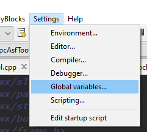
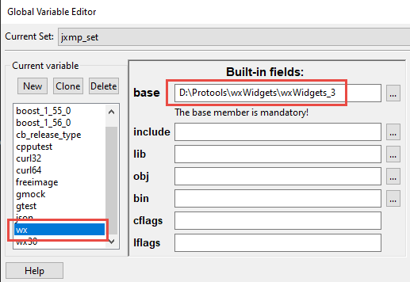
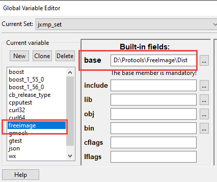
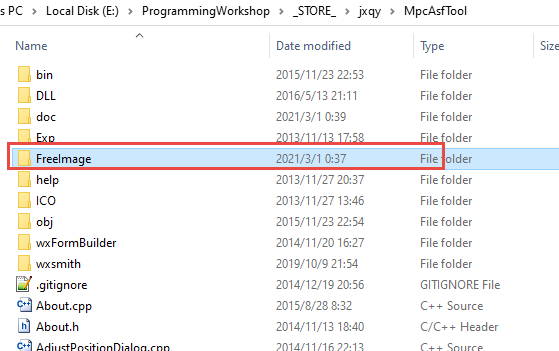

剑侠情缘单机 MPC ASF 文件 编辑 工具

早期的程序，代码写的比较烂，呵呵

---

## 如何编译：

1.下载[wxWidget 3.0.0版本](https://github.com/wxWidgets/wxWidgets/releases/download/v3.0.0/wxWidgets-3.0.0.7z)

2.使用MinGW编译器（使用CodeBlocks内置的MinGW编译器即可），编译wxWidget，编译教程见，wxWidgets路径/docs\msw\install.txt

`mingw32-make -f makefile.gcc BUILD=debug`

`mingw32-make -f makefile.gcc BUILD=release`

3.在CodeBlocks里

设置wx变量，base是wxWidgets库的路径

设置freeimage变量，base用工程里的FreeImage库

4.如果要Build Release-static，需要[upx](https://upx.github.io/)来压缩exe文件，把upx.exe放在PATH系统变量的任何路径里的文件夹就可以